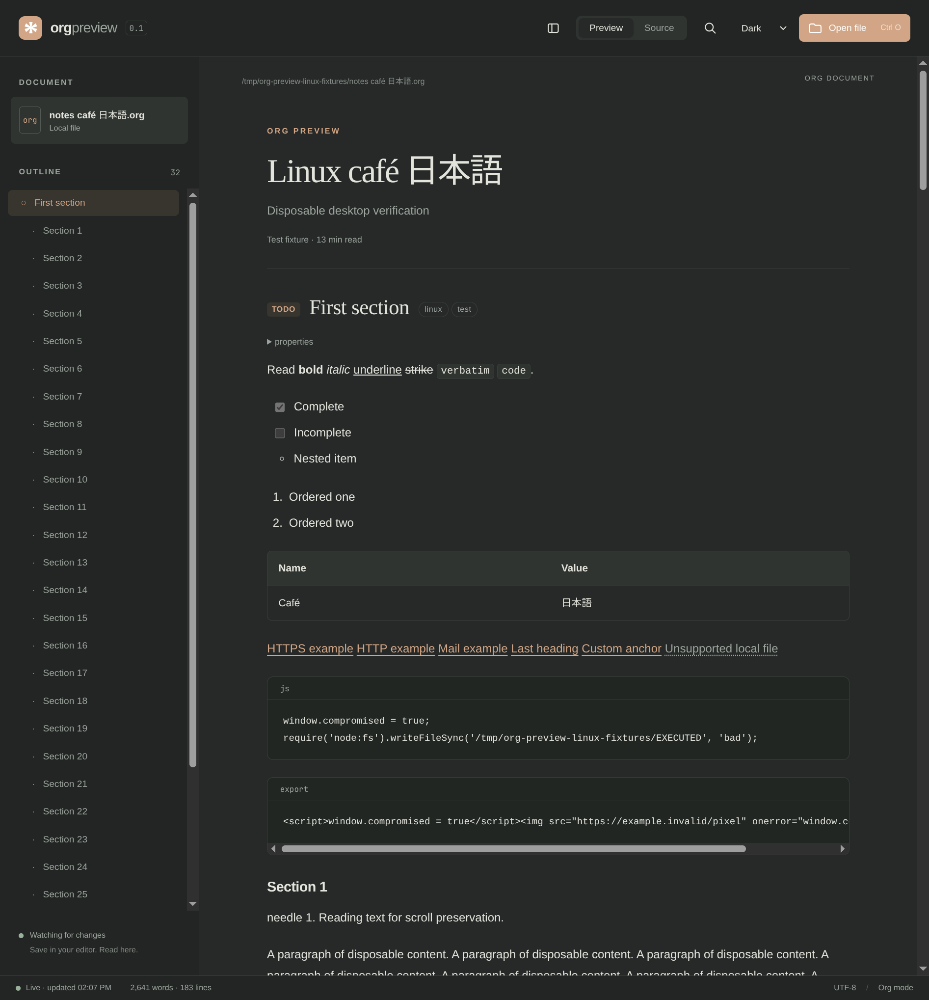
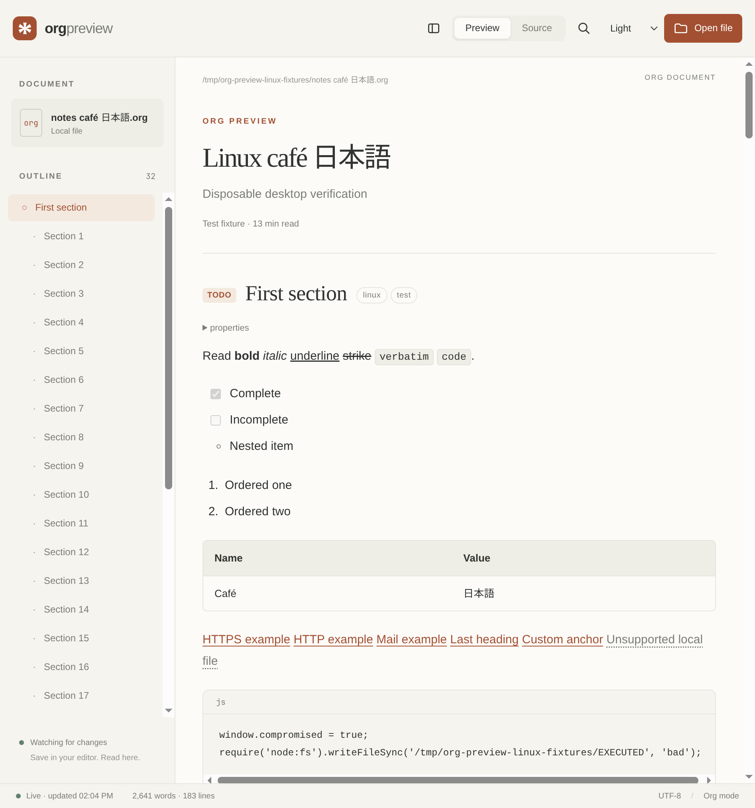
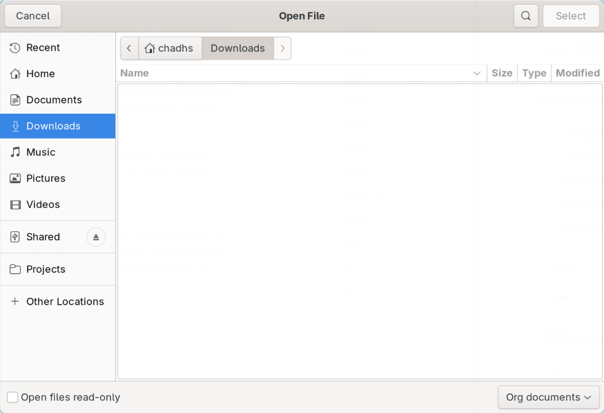
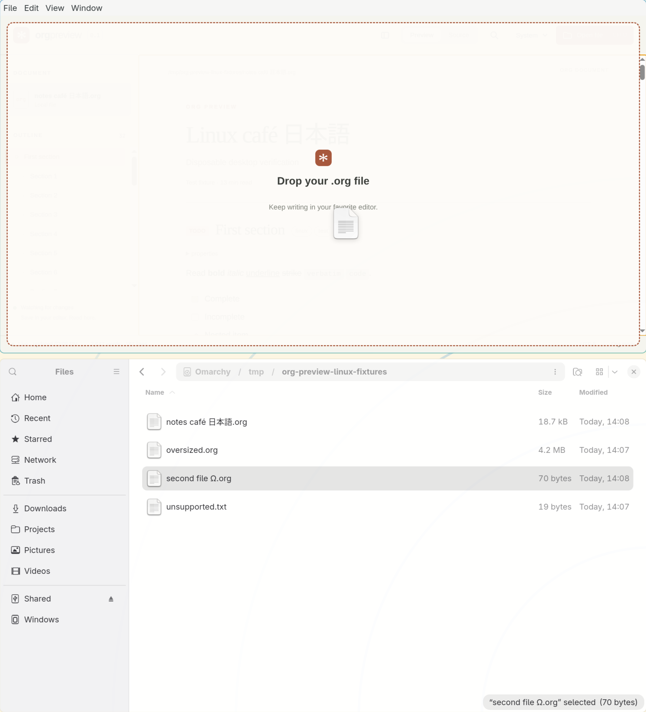
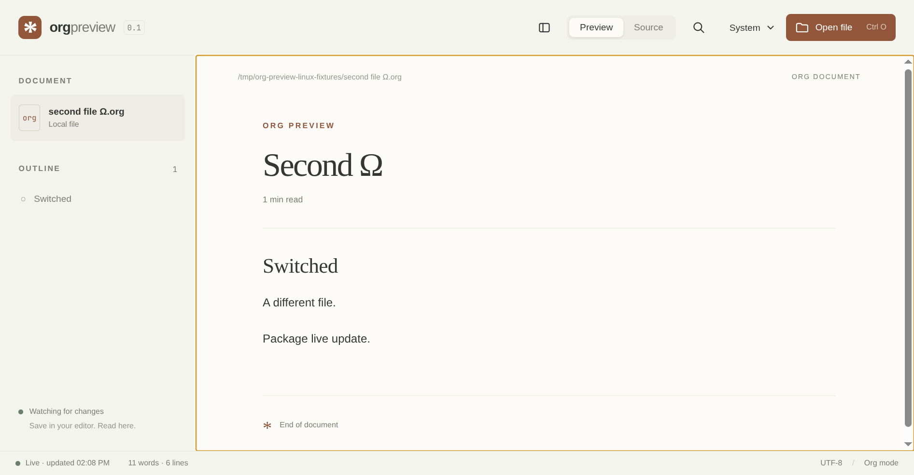
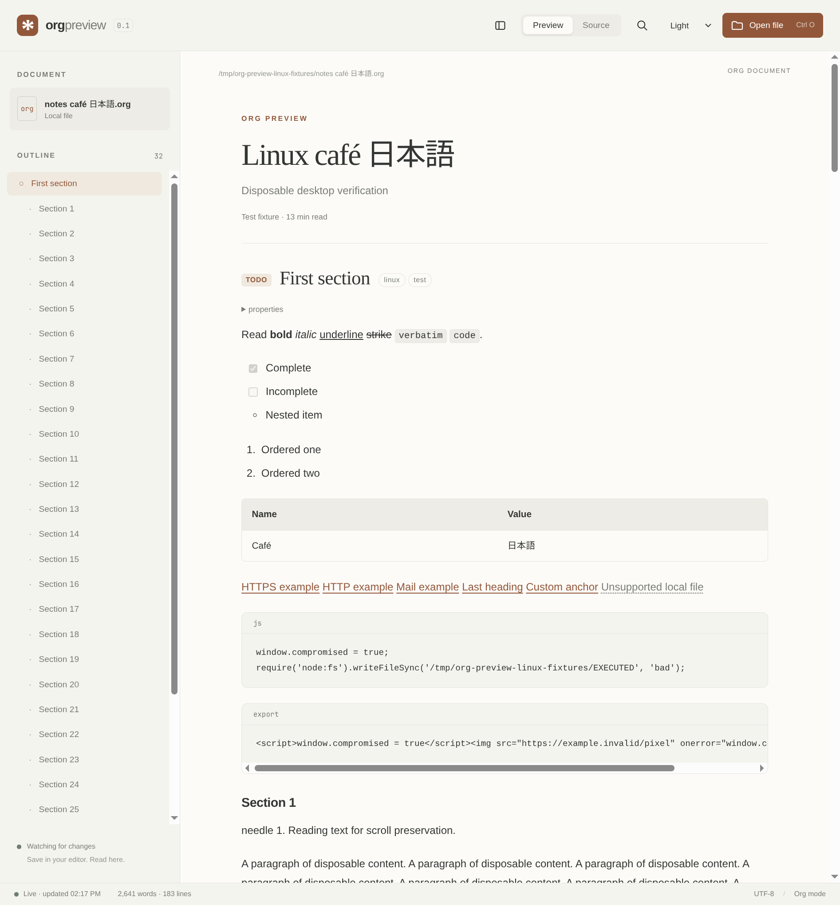
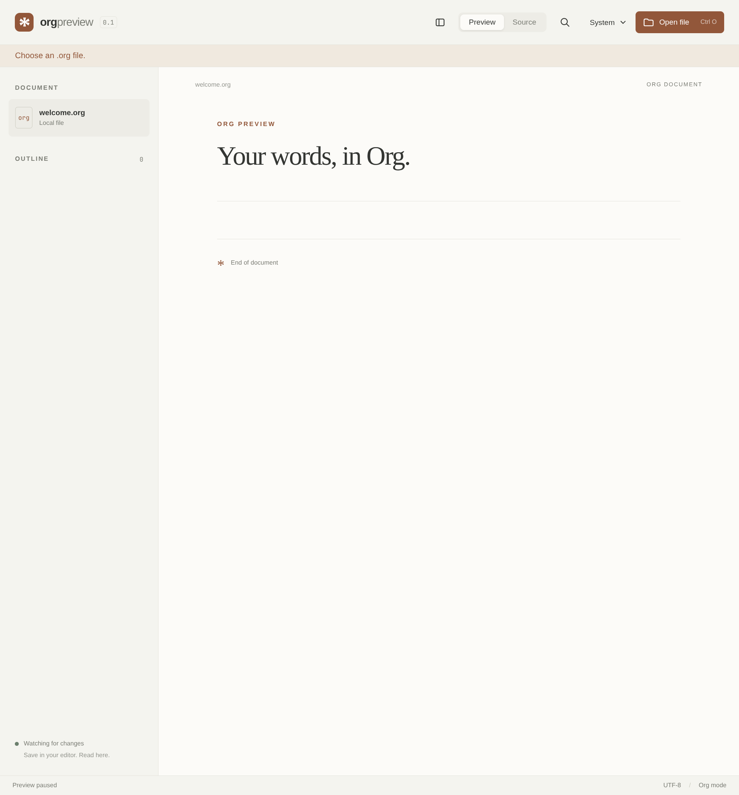

#+title: Linux testing
#+date: 2026-09-08

* Result
The development app works on native Wayland and XWayland on this Omarchy
machine. The packaged AppImage works with extract-and-run, and the extracted
tar application works directly. Direct FUSE-mounted AppImage launch is
blocked by the machine's missing =libfuse.so.2=.

The tested branch is =MVP-v0.1=, starting at
=c6ce0e795162d2782a211dda346690e0aa0e33cc=. The checkout was newly cloned to
=~/src/chadhs/org-preview= and had no local changes. No merge to main or
release publication was performed.

* Machine and toolchain
| Item                 | Observed value                         |
|----------------------+----------------------------------------|
| Distribution         | Omarchy 4.0.2, Arch-based               |
| Kernel               | 7.1.9-arch1-2                           |
| Architecture         | x86_64                                 |
| Desktop/compositor   | Hyprland 0.56.2                        |
| Session              | Wayland, WAYLAND_DISPLAY=wayland-1     |
| XWayland             | 24.1.13-1, DISPLAY=:0                  |
| Node used for tests  | 24.20.0, installed through mise         |
| npm                  | 11.19.0                                |
| Original default Node | 26.7.0, global selection unchanged     |
| Electron             | 44.2.0                                 |
| Orga                 | 4.7.1                                  |
| DOMPurify            | 3.4.15                                 |

Commands used =mise exec node@24 --= to select Node 24. GitHub operations
used the personal source directory's direnv and the =chadhs= account.
No desktop configuration, sandbox permissions, or system packages were changed.

* Build and automated checks
All app instances were closed before the standalone automated smoke runs.

| Command                              | Result                         |
|--------------------------------------+--------------------------------|
| npm ci                               | Pass, 305 packages, audit clean |
| npm run check                        | Pass, 9 tests and Vite build   |
| npm run test:smoke                    | Pass with Chromium sandbox    |
| npm run test:smoke -- --ozone-platform=wayland | Pass                   |
| npm run test:smoke -- --ozone-platform=x11     | Pass                   |
| npm run dist:linux                   | Pass, AppImage and tar.gz     |

The initial smoke run used Playwright's implicit =--no-sandbox= default.
That run is excluded from validation. The test now explicitly sets
=chromiumSandbox: true= and asserts that its launch flags omit
=--no-sandbox= and its renderer preferences enable sandboxing. All accepted
smoke runs used that correction. No sandbox bypass was used to resolve a
launch failure.

The smoke script now covers Unicode paths, Chromium file-backed drops,
unsupported and oversized files, a second CLI invocation, watcher switching,
HTTP/HTTPS/mailto dispatch, and scroll preservation with search open.
It stubs the native picker and =shell.openExternal=; real picker and native
drag checks were performed separately. The named Wayland/XWayland smoke
runs preceded the final mixed-list fix. Both real development windows and
both packaged apps subsequently exercised that fix; the final default smoke
run also passed after all code changes.

* Real desktop checks
Disposable UTF-8 Org files under =/tmp/org-preview-linux-fixtures= included
=notes café 日本語.org= and =second file Ω.org=. The oversized fixture was
4,194,305 bytes. A copy of the rendered fixture is in the evidence directory.

| Check                              | Observation                         |
|------------------------------------+-------------------------------------|
| Native GTK file picker             | Opens spaces/Unicode paths          |
| Native Files-to-app drag            | Pass on Wayland; overlay and open   |
| Chromium file-backed drag/drop      | Pass on Wayland and XWayland        |
| Initial command-line opening        | Opens spaces/Unicode paths          |
| Second-instance command line        | Switches file; relative Unicode path verified in tar app |
| Unsupported initial CLI path        | Helpful error; recovers by opening Org file |
| Headings and outline                | 32 headings; navigation works       |
| Tasks and tags                      | TODO/DONE and tags render           |
| Emphasis, lists, checkboxes          | Render; checkboxes remain read-only |
| Mixed numbered/bulleted lists        | Correct after marker-group fix      |
| Tables and source blocks             | Render; code stays literal          |
| HTTP/HTTPS/mailto                   | Render and dispatch through safe IPC; OS handler stubbed in smoke |
| Internal heading and CUSTOM_ID links | Navigate within the document        |
| Search                              | Count, Enter/Shift+Enter, next/previous and wrap work |
| Source view                         | Original text; separate view scroll positions |
| Themes                              | Light, dark, system selectable      |
| Native zoom shortcuts               | Zoom in/out/reset change viewport   |
| External save                       | Refreshes; scroll preserved         |
| Save with search open               | Retains 3,000 px and match 2/31      |
| Atomic replacement                  | Refreshes and keeps watching        |
| Delete and recreate                 | Explains missing file, then recovers |
| Switching files                     | Old file stops publishing updates   |
| Unsupported extension               | "Choose an .org file."              |
| More than 4 MB                      | Explains the 4 MB limit              |
| HTML and JavaScript source fixture  | No script/img elements, no global side effect or sentinel file |

The native drag was repeated after the user reported simultaneous desktop
interaction. The isolated retry passed. Earlier interrupted attempts are
not recorded as application failures. A temporary virtual pointer delivered
real motion/button events from Nautilus to the Wayland window and was
removed after the operation.

Native zoom changed the CSS viewport width from 1,183 to 1,080 pixels,
then back to 1,183 on zoom-out/reset. No renderer page errors occurred in
the final desktop and packaged fixture runs.

* Packaged applications
The final =npm run dist:linux= output was tested, rather than only
=release/linux-unpacked=.

| Launch                                            | Result                     |
|---------------------------------------------------+----------------------------|
| AppImage directly                                 | Blocked: libfuse.so.2 absent |
| AppImage --appimage-extract-and-run, Wayland        | Pass                       |
| Extracted tar.gz executable, Wayland               | Pass                       |

Both running packages opened the Unicode/spaced path from argv and passed
file-backed drops, external saves, atomic replacement, delete/recreate,
switching files, size/type errors, search-scroll preservation, and inert
HTML/source checks. The tar executable also passed second-instance CLI
handoff with a relative Unicode path and the native GTK picker followed by
an external save. Packaged XWayland launch was not separately tested.

Example commands, with disposable fixture paths:

#+begin_src sh
./release/Org\ Preview-0.1.0.AppImage --appimage-extract-and-run \
  --ozone-platform=wayland '/tmp/org-preview-linux-fixtures/notes café 日本語.org'

mkdir -p /tmp/org-preview-tar-test
tar -xzf release/org-preview-0.1.0.tar.gz -C /tmp/org-preview-tar-test
/tmp/org-preview-tar-test/org-preview-0.1.0/org-preview \
  --ozone-platform=wayland '/tmp/org-preview-linux-fixtures/notes café 日本語.org'
#+end_src

The UI inspections used a loopback DevTools port and disposable
=--user-data-dir= paths. These instrumentation flags did not disable the
sandbox. Renderer process evidence includes =--enable-sandbox=,
=NoNewPrivs: 1=, =Seccomp: 2=, and nested PID namespaces for the development
and packaged applications.

* Confirmed problems fixed
- Smoke tests silently disabled the Linux Chromium sandbox. Require it and
  verify the launch flags and renderer preferences.
- Orga's =mailto= address omits the protocol in =path.value=. Reassemble it
  before rendering and test safe external-link dispatch.
- Rebuilding search after a save reset the active match and scrolled to the
  first result. Rebuild highlights without scrolling and retain the match.
- CLI argument filtering silently discarded unsupported extensions. Pass
  positional paths to the normal reader validation, for both initial and
  second-instance opening.
- Orga can group numbered and bulleted items in one list node. Split HTML
  lists using each item's marker while preserving nested lists.

Focused parser/argument tests and desktop regressions cover these changes.
No dependencies or lockfile entries changed. Project code remains
BSD-3-Clause. Existing notices retain Orga and its MIT dependencies,
DOMPurify's Apache-2.0 option, and Electron/Chromium license files in the
packages.

* Limitations and follow-up
- FUSE 2 is not installed. Direct mounted AppImage execution remains
  unverified here; extract-and-run and tar execution pass.
- Wayland logs a Chromium Vulkan compatibility message. Rendering and
  interaction still pass without graphics or sandbox overrides.
- electron-builder warns about the default Electron icon and absent
  =desktopName=. Installed desktop-file association was not verified.
- Native picker and native file-manager drag were verified on Wayland.
  XWayland used the real app with Chromium file-backed drag injection.
- HTTP/HTTPS/mailto link dispatch was verified with a stubbed OS opener.
  Default browser/mail-client integration remains a separate manual check.
- macOS packaging, Finder opening, signing and notarization were not tested
  on this Linux machine. Signing is already outside v0.1.
- Existing v0.1 exclusions remain: editing, agenda/task management, Babel,
  remote includes, cloud sync, full export parity, math/diagram engines,
  local images/file links, custom handlers, automatic updates and an AUR
  package. Their absence is not a test failure.

* Evidence
Selected screenshots, successful logs, process evidence, the fixture and
artifact hashes are committed under [[file:docs/linux-testing/2026-09-08/][docs/linux-testing/2026-09-08/]].
Full local logs and additional screenshots remain in =test-results/linux/=;
built artifacts remain in =release/=. Neither directory is committed.

-  and .
- .
- .
-  and .
-  and .
- .
