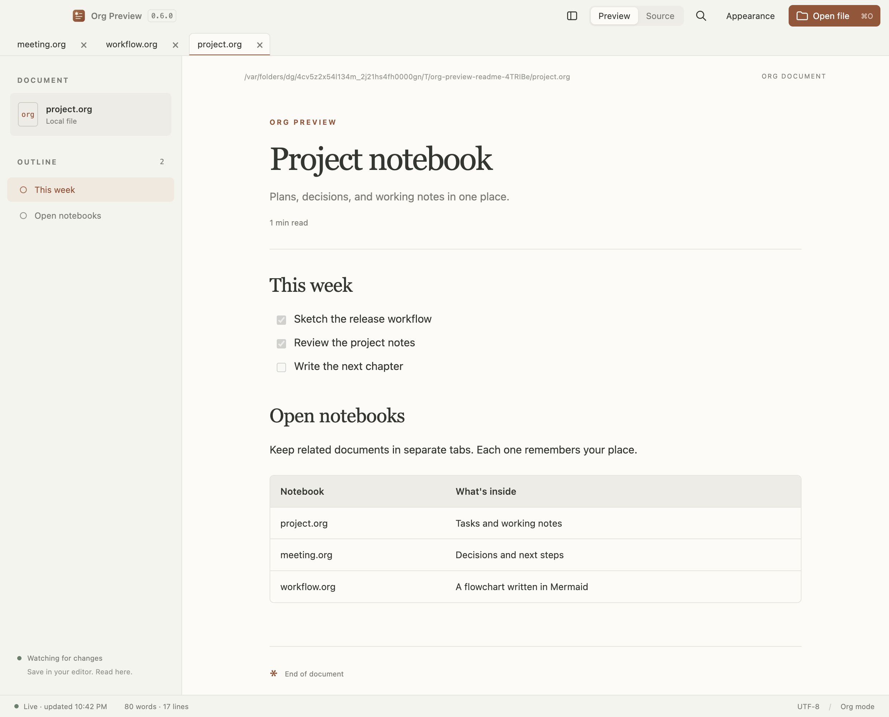
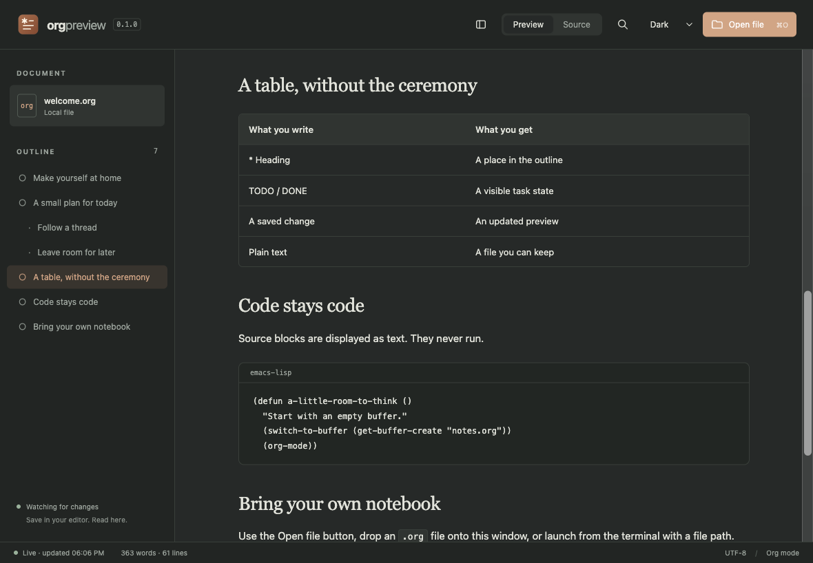

#+title: org-preview
#+subtitle: A live preview for people who write in Org mode

[[#install][Install on macOS or Omarchy]]

* Screenshots
Light preview with the document outline:

Dark preview showing Org tables and source blocks:

* Install
You do not need Node.js, npm, or Emacs to use a downloaded release.
Supported downloads are macOS Apple Silicon and Linux x86_64, including
Arch-based systems such as Omarchy.

After merging, wait for the [[https://github.com/chadhs/org-preview/actions/workflows/release.yml][Release a minor version workflow]] to finish.
Then open [[https://github.com/chadhs/org-preview/releases/latest][the latest release]] and expand *Assets*. The first release is =v0.1.0=.
If no release appears, check that workflow before trying to download.
Choose the application package below, not GitHub's *Source code* archives.

| Your system              | Download                           |
|--------------------------+------------------------------------|
| macOS, Apple Silicon     | org-preview-VERSION-arm64.dmg       |
| Omarchy / Arch, x86_64    | org-preview-VERSION.tar.gz          |
| Linux portable alternative | org-preview-VERSION.AppImage     |

=VERSION= means the number on the release page, without the =v= prefix.
Download the matching =SHA256SUMS-darwin-arm64.txt= or
=SHA256SUMS-linux-x64.txt= too. Optional verification commands are below.

** macOS: install in Applications
1. Download the =arm64.dmg= file. In About This Mac, the Chip field should
   name an Apple chip such as M1, M2, M3, or later. Intel Macs have no binary
   in this release.
2. Quit any running Org Preview copies, including development builds.
3. Open the DMG and drag *Org Preview.app* into *Applications*. Replace an
   older copy if you are updating. Eject the disk image afterward.
4. Open *Applications → Org Preview*. Launch the installed copy rather than
   a copy inside Downloads or the mounted disk image.
5. Click *Open file* or press =⌘O= and choose an =.org= file. You can also drag
   a file into the app, or use Finder's *Open With → Org Preview*.

Mac builds use an ad-hoc signature to seal the app's contents. They are not
Developer-ID-signed or notarized, so Apple does not automatically trust the
download. You do not need an Apple Developer Program membership to run it.
If you trust this repository and macOS says it could not verify Org Preview:

1. Try opening the installed app once and click *Done* on the alert.
2. Open *System Settings → Privacy & Security*.
3. Find the message about Org Preview and choose *Open Anyway*, then confirm
   *Open*. Authenticate if macOS asks. This approves this app specifically;
   Gatekeeper remains enabled for other apps.

See [[https://support.apple.com/en-us/102445][Apple's first-launch instructions]]. If macOS reports a damaged app,
re-download it and compare its checksum. Report the exact alert if that
persists or the approval option is unavailable.

Keep one installed copy to avoid ambiguous Finder entries. To make previews
the default for =.org= files, optionally choose an Org file in Finder, press
=⌘I=, select Org Preview under *Open with*, and click *Change All*.

You can open files from Terminal after installation:

#+begin_src sh
open -a 'Org Preview' "$HOME/notes/today.org"
#+end_src

The ZIP is an alternative to the DMG: unzip it and move its app to
Applications, then follow the same first-launch steps.

** Omarchy / Arch: install the tar package
The application was tested on Omarchy 4.0.2 with Hyprland 0.56.2, using
native Wayland and XWayland. This installation needs no FUSE and no =sudo=.
There is no AUR or pacman package yet.

Download =org-preview-VERSION.tar.gz= to your Downloads folder. Run the
following in a terminal. Change =ORG_PREVIEW_VERSION= to match your download;
=0.1.0= is correct for the first release.

#+begin_src sh
ORG_PREVIEW_VERSION=0.1.0
cd "$HOME/Downloads"
mkdir -p "$HOME/.local/opt" "$HOME/.local/bin"
tar -xzf "org-preview-$ORG_PREVIEW_VERSION.tar.gz" -C "$HOME/.local/opt"
ln -sfn "$HOME/.local/opt/org-preview-$ORG_PREVIEW_VERSION/org-preview" "$HOME/.local/bin/org-preview"
"$HOME/.local/bin/org-preview"
#+end_src

The app opens its welcome document. Click *Open file*, press =Ctrl+O=, or
drag an =.org= file into the window. To open a file from a terminal:

#+begin_src sh
"$HOME/.local/bin/org-preview" "$HOME/notes/today.org"
#+end_src

If =~/.local/bin= is already in your PATH, =org-preview= works as a shorter
command. The full path above works without changing shell configuration.

*** Add Org Preview to the app launcher
This optional step creates a user-local desktop entry with the app's icon.
Set the version to the one you installed, then paste the whole block:

#+begin_src sh
ORG_PREVIEW_VERSION=0.1.0
mkdir -p "$HOME/.local/share/applications"
cat > "$HOME/.local/share/applications/org-preview.desktop" <<EOF_DESKTOP
[Desktop Entry]
Type=Application
Name=Org Preview
GenericName=Org document viewer
Comment=Read Org files and follow changes as you save
Exec="$HOME/.local/bin/org-preview" %f
Icon=$HOME/.local/opt/org-preview-$ORG_PREVIEW_VERSION/resources/icon.png
Terminal=false
Categories=Office;
MimeType=text/org;text/x-org;
StartupWMClass=org-preview
Keywords=org-mode;Emacs;notes;
EOF_DESKTOP
if command -v update-desktop-database >/dev/null 2>&1; then
  update-desktop-database "$HOME/.local/share/applications"
fi
#+end_src

Open Omarchy's app launcher and search for *Org Preview*. The file manager
can also offer it under *Open With*. Optionally make it the default Org
viewer after creating the desktop entry:

#+begin_src sh
xdg-mime default org-preview.desktop text/org
xdg-mime default org-preview.desktop text/x-org
#+end_src

*** AppImage alternative
Download the AppImage to Downloads and use this block, changing the version
if necessary. The extract-and-run option works without FUSE 2 and was tested
on Omarchy:

#+begin_src sh
ORG_PREVIEW_VERSION=0.1.0
cd "$HOME/Downloads"
chmod +x "org-preview-$ORG_PREVIEW_VERSION.AppImage"
"./org-preview-$ORG_PREVIEW_VERSION.AppImage" --appimage-extract-and-run
#+end_src

If [[https://archlinux.org/packages/extra/x86_64/fuse2/][fuse2]] is installed, you can omit =--appimage-extract-and-run=.
The test machine lacked FUSE 2, so direct mounted execution was not verified.
See [[https://docs.appimage.org/user-guide/troubleshooting/fuse.html][AppImage's FUSE guidance]] if needed. Neither AppImage launch mode
installs a launcher by itself; use the tar instructions above for a persistent
user-local installation with a desktop entry.

*** Wayland and XWayland
Both backends were tested. If you need to select one explicitly:

#+begin_src sh
"$HOME/.local/bin/org-preview" --ozone-platform=wayland "$HOME/notes/today.org"
# Alternatively, through XWayland:
"$HOME/.local/bin/org-preview" --ozone-platform=x11 "$HOME/notes/today.org"
#+end_src

Run the app as your normal desktop user. Sandboxing stays enabled.

** Verify a download
Run the appropriate command in Downloads and compare its hash with the
same filename in the downloaded =SHA256SUMS-*.txt= file. These examples use
the first release; change the version for a later download.

#+begin_src sh
# macOS:
cd "$HOME/Downloads"
shasum -a 256 'org-preview-0.1.0-arm64.dmg'

# Omarchy / Linux:
cd "$HOME/Downloads"
sha256sum org-preview-0.1.0.tar.gz
#+end_src

** Start using it
Open a notebook in Org Preview and the same file in your editor. Save a
change in the editor; the preview updates automatically. Search with
=⌘F= / =Ctrl+F= and switch to read-only source with =⌘⇧S= / =Ctrl+Shift+S=.
Your files stay local. Opening a preview does not modify the document.

** Update to a later version
There is no in-app updater yet. Download the new release and quit the old
app first. On macOS, replace the Applications copy. On Omarchy, rerun the
tar installation and desktop-entry blocks with the new version; they update
the command link and icon path. Your Org files are independent of the app.

* Why
Org files are comfortable to write and read as plain text. They deserve a
standalone reader that renders them well, too.

org-preview will be a free, open-source desktop app for opening =.org= files
and watching the preview update as you save changes in your favorite editor.
It takes inspiration from [[https://markdownpreview.app][Markdown Preview]], with Org syntax and equal attention
to macOS and Linux, including Omarchy.

* Goal
Open a file, read it, and keep writing in the editor you already use. No
account, cloud service, or Emacs installation should be required.

* Scope for v0.1
- Open local =.org= files through a file picker, drag and drop, or the command line.
- Refresh the document after external saves, including atomic file replacement.
- Render headings, emphasis, links, lists, checkboxes, tables, and source blocks.
- Show an outline, TODO states, tags, and document metadata.
- Provide search, a read-only source view, and light and dark themes.
- Keep document content local and never execute Babel blocks or embedded HTML.
- Provide a repeatable build for macOS and Linux.

* Approach
Use Electron for the desktop shell and Orga for parsing Org syntax. A
sandboxed renderer displays sanitized HTML. The first prototype favors a
working file-to-preview loop over complete Org export compatibility.

* Outside the first release
- An editor, agenda, task manager, or replacement for Emacs.
- Babel execution, remote includes, or cloud synchronization.
- Full Org export parity, LaTeX rendering, and diagram engines.
- Finder Quick Look, Developer ID signing/notarization, automatic updates,
  and an AUR package.

* Run from source
Use Node.js 24 LTS and npm. No Emacs installation is needed.

#+begin_src sh
git clone https://github.com/chadhs/org-preview.git
cd org-preview
npm ci
npm run dev
#+end_src

The first launch opens =examples/welcome.org=. Electron downloads its runtime
on first use, so installation and that first launch need internet access.
Reading your files after setup works offline.

To open a particular file, pass its path. Quote paths containing spaces.

#+begin_src sh
npm run dev -- ~/notes/today.org
# After the first build, skip rebuilding to launch again:
npm start -- ~/notes/today.org
#+end_src

Open files with the toolbar, drag and drop, or =Cmd/Ctrl+O=. Save in your
editor to refresh the preview. The app polls the open file every 300 ms and
keeps watching after atomic saves or deletion and recreation. It opens one
file at a time and supports UTF-8 files up to 4 MB.

Use =Cmd/Ctrl+F= to search. Enter advances to the next match and Shift+Enter
moves back. Search stays inside the current document view and shows up to
1,000 matches. =Cmd/Ctrl+Shift+S= switches between preview and read-only source.
Use =Cmd/Ctrl++= and =Cmd/Ctrl+-= to zoom. Click the file card to reveal the
file in Finder or your file manager.

* Build a desktop app
Run these commands on the target operating system. Build output goes in
=release/=. These commands create local artifacts and do not publish releases.

#+begin_src sh
npm run dist:mac    # .dmg and .zip for the Mac's architecture
npm run dist:linux  # .AppImage and .tar.gz for the Linux machine's architecture
npm run pack       # Unpacked application for a quick packaging check
npm run checksums  # SHA-256 sums for the packages in release/
#+end_src

macOS builds are ad-hoc signed. CI verifies the signatures inside both ZIP
and DMG packages. Developer ID signing and notarization are still needed
for downloads that macOS trusts automatically. The app declares itself as
an Org file viewer so installed builds can appear in Open With.

* Automatic releases
Every push to =main=, including merge, squash, and rebase merges, starts a
minor release. Documentation-only merges also release. The first version is
=0.1.0=; subsequent versions increment the highest stable tag's minor number
and reset its patch number, for example =0.2.0= and =0.3.0=.

Open PRs and manual Desktop checks runs only validate builds. Main releases use
the same build workflow, stamp the selected version into both package files,
and require all tests, platform builds, and artifact checks to pass before
publishing. The app's version label follows that stamped version.

Release runs queue instead of canceling earlier pending merges. GitHub can
queue up to 100 pending runs. A merged-PR fallback also listens for completed
merges, so a skip marker inherited by a squash message cannot suppress a
release. It runs only after merging into main, checks out that exact merged
commit, and verifies that the commit belongs to main's history. It never
executes an unmerged PR head. Duplicate push/merge events reuse the same
release and do not increment the version twice.

For recovery, open Actions → Release a minor version → Run workflow and
select =main=. This uses the same checks, checksum verification, and retry
rules. A manual run for an already-published main commit does nothing. Direct
pushes containing skip markers can be recovered this way too.

Only the publisher job has repository write permission. It checks all four
packages against their checksums, creates a versioned source commit and tag,
uploads six assets to a draft, then publishes after every upload succeeds.
The tagged commit has the merged main commit as its parent. It updates only
the package versions, so checking out a tag reproduces the released version.
The workflow never pushes a version-bump commit back to =main= or triggers
a release loop. Main's package version is the development baseline.

If a run fails, fix the cause and rerun it in Actions. A retry reuses any tag
already assigned to that source commit and completes a partial draft.
Published releases and their assets are left untouched. An older draft retry
will not replace a newer release as GitHub's latest release. Failed builds
publish nothing. Generated release notes list changes since the previous tag
and include version-specific installation instructions and known limits.

* What v0.1 renders
- Document title, subtitle, author, headings, and outline navigation.
- TODO and DONE states, priorities, tags, planning lines, and folded drawers.
- Bold, italic, underline, strike-through, code, and verbatim text.
- Ordered and unordered lists, nested lists, and read-only checkboxes.
- Tables, source/example blocks, quotes, and HTTP/HTTPS/mailto links.
- Internal heading links and =CUSTOM_ID= links for common cases.

The preview uses Orga's syntax tree and an explicit HTML renderer. It is not
Emacs's exporter. Custom TODO workflows, footnotes, inline math, timestamps,
macros, export options, and complex Org constructs may display literally or
incompletely. Source view always shows the original file.

Local images and links to other files are not opened in this prototype.
Raw export blocks display as text. Babel, includes, embedded HTML, and
custom URL handlers never execute. Documents cannot fetch network resources.
Clicking a web link opens your browser. No telemetry or cloud services.

* Development and checks
#+begin_src sh
npm run check       # Parser/file-watcher tests and production renderer build
npm run test:smoke  # Actual Electron UI and external-save tests
npm run notices     # Refresh bundled dependency license texts
npm run icons       # Regenerate native icons from assets/icon.svg
#+end_src

On a headless Linux machine, run the desktop smoke test with
=xvfb-run --auto-servernum npm run test:smoke=.

GitHub Actions runs tests, desktop smoke checks, and packaging on macOS and
Linux. Successful runs provide prototype installers as workflow artifacts.
The smoke test requires Chromium sandboxing and checks rendering, source
view, themes, search and scroll preservation, Unicode file opening,
file-backed drops, input errors, CLI handoff, saves, atomic replacement,
delete/recreate recovery, watcher switching, and supported-link dispatch.
Screenshots are saved in =test-results/=.

The smoke test uses a disposable profile. To test a packaged executable, set
=ORG_PREVIEW_EXECUTABLE= to its absolute path and run =node scripts/smoke.mjs=.
On macOS it also checks Finder-style file events and the native Open command
after the last window closes. CI runs this suite against the macOS ZIP artifact.
Native Mac checks covered file picking, Finder opening and dragging, browser
and mail links, and keyboard shortcuts on Apple Silicon. The Mac packages
are ad-hoc signed and unnotarized; first launch requires app-specific
approval. Keep one installed copy to avoid ambiguous Finder Open With entries.

Keep the automated tests in =test/= and =scripts/smoke.mjs=: they protect
rendering, file watching, sandboxing, and release publication. Test fixtures
are temporary, and logs/screenshots belong in ignored =test-results/= or
CI artifacts. One-off test-session records and handoffs are not maintained
in the source tree.

| Path                   | Purpose                            |
|------------------------+------------------------------------|
| =electron/main.cjs=    | Window, file opening, and safe IPC  |
| =electron/documents.cjs= | Bounded reads and file watching  |
| =electron/preload.cjs= | Narrow bridge to the renderer      |
| =src/org.js=          | Org AST to escaped HTML            |
| =src/app.js=          | Reading interface and navigation   |
| =src/search.js=       | Search ranges inside the document  |
| =examples/welcome.org= | A notebook to try on first launch |

The first commit contains only this project's original goal and scope.
See [[file:RELEASE-NOTES.org][release information]] for packages, installation instructions, and known limits.

* License and acknowledgments
The project uses the [[file:LICENSE][BSD 3-Clause license]]. The [[https://github.com/orgapp/orgajs][Orga]] parser is MIT-licensed.
[[https://github.com/pluk-inc/markdown-preview][Markdown Preview]] inspired the workflow. This is an independent implementation.

See [[file:THIRD-PARTY-NOTICES.org][third-party notices]] for dependency licenses.
